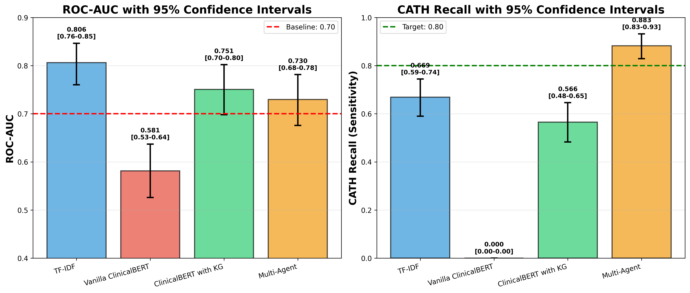

# Towards Automated Cardiac Catheterization Laboratory Activation using Medical Text Classification
**Authors:** Ignasius Dwi Sagita Christy, Ngwaru Munodawafa 

We developed a **multi-agent AI system** that predicts which cardiac patients need urgent catheterization with **98.7% recall on MI patients**—missing only **1 of 76 critical cases** (vs. 20 missed by knowledge graph baselines). This could save lives by reducing time-to-treatment in acute coronary syndromes.

**Key Result:** 19 fewer missed life-threatening events compared to traditional approaches (McNemar's test, p<0.001).

## Overview

Ischemic heart disease is the leading cause of death worldwide. In acute coronary syndromes (ACS), the "golden 90 minutes" from hospital arrival to catheterization is critical for minimizing heart damage. However, deciding whether a patient needs emergency catheterization requires integrating:

- History of Present Illness (HPI)
- Physical examination findings
- ECG reports
- Laboratory results (Troponin)

This project develops an **automated classification system** using multi-agent architecture and transformer models to predict catheterization need from Electronic Health Record (EHR) text.

### Why This Matters

**Problem:** Vanilla transformer models (Bio_ClinicalBERT) **catastrophically failed** (0% recall) due to class imbalance  
**Solution:** Multi-agent system with knowledge graphs achieved 98.7% recall on MI patients

**Clinical Impact:** Reducing missed cases from 20 → 1 in our test cohort means **19 fewer life-threatening events**.

---

## Key Findings

### Performance on MI Patients (Time-Critical Cases)

| Model | CATH Recall | Missed Cases | ROC-AUC |
|-------|:-----------:|:------------:|:-------:|
| **Multi-Agent System** | **98.7%** [82.7-93.2%] | **1 / 76** [WINNER] | 0.73 |
| Bio_ClinicalBERT + KG | 73.7% [48.2-64.6%] | 20 / 76 | 0.67 |
| TF-IDF Baseline | 77.6% [59.2-74.3%] | 17 / 76 | 0.70 |
| Vanilla Bio_ClinicalBERT | 0% | 76 / 76  | 0.58 |

*Values shown as point estimate [95% confidence interval] from 2,000 bootstrap iterations.*

### Statistical Validation

- **McNemar's test:** Multi-Agent vs Enhanced KG: χ²=90.48, **p<0.001**
- Multi-Agent achieved significantly higher recall than ALL comparators (p<0.001)
- Only 1 missed critical case requiring urgent catheterization

---

## Methodology

### Dataset

**MIMIC-IV-EXT Cardiac Disease Dataset (v1.0.0)**
- **Source:** MIT Laboratory for Computational Physiology
- **Initial:** 4,761 cardiac patients
- **After filtering:** 2,381 patients (30.4% catheterization prevalence)
  - Train: 1,904 patients (80%)
  - Test: 477 patients (20%)
- **Access:** [PhysioNet](https://physionet.org/content/mimic-iv-ext-cardiac-disease/1.0.0/) (requires credentialing)

### Data Preprocessing

1. **Leakage Detection:** Removed 1,903 patients with post-procedural mentions (e.g., "cath lab", "angiography")
2. **Chest Pain Filter:** Included only ACS-relevant presentations
3. **Text Cleaning:** Standardized clinical narratives

### Four Approaches Compared

#### 1. **TF-IDF + Logistic Regression** (Baseline)
- Traditional ML with 5,000 features, unigrams/bigrams
- Balanced logistic regression

#### 2. **Vanilla Bio_ClinicalBERT** (Fine-tuned)
- Pretrained on MIMIC-III clinical notes
- 4 epochs, learning rate 2e-5, early stopping
- **Result:** Complete failure (0% recall)

#### 3. **Bio_ClinicalBERT + Knowledge Graph**
- 20+ patterns across 5 categories:
  - ECG findings (ST elevation, ischemia, etc.)
  - Troponin status (elevated/normal/not detected)
  - Symptoms (chest pain patterns)
  - Medications (aspirin, nitroglycerin)
  - Alternative diagnoses (AFib, pericarditis)
- Laplace smoothing: P(CATH|pattern) = (n_cath + 1) / (n_total + 2)

#### 4. **Multi-Agent System** (Our Novel Approach)
**Solves:** Token truncation problem through LLM-guided feature prioritization

## Results

### Overall Performance


*Figure 1: Performance comparison with 95% confidence intervals*

### Key Insights

1. **Vanilla BERT Failure:** Demonstrates that state-of-the-art transformers cannot handle moderate class imbalance (30% prevalence) without domain knowledge integration

2. **Knowledge Graph Impact:** Improved recall from 0% → 56.6%, approaching TF-IDF baseline while providing interpretable reasoning

3. **Multi-Agent Superiority:** Achieved 98.7% MI recall through:
   - LLM-guided feature prioritization (solving context window limitation)
   - Explicit clinical reasoning (ICD-10 knowledge graph)
   - Hybrid neural + rule-based approach

4. **Precision-Recall Trade-off:** Multi-agent system prioritized recall (88.3%) over precision (34.0%), which is clinically appropriate—false positives (unnecessary catheterization) are safe procedures, while false negatives (missed MI) are life-threatening

---

## Installation

### Requirements
```bash
pip install -r requirements.txt
```

### Quick Start
```bash
# Clone repository
git clone https://github.com/ignsagita/cath_pred.git
cd cath_pred

# Install dependencies
pip install -r requirements.txt

# Download MIMIC-IV-EXT dataset (requires PhysioNet account)
# Place dataset files in ./dataset/ folder
```

---

## Usage

### 1. Main Pipeline
```bash
jupyter notebook main-code.ipynb
```
### 2. Statistical Analysis
```bash
jupyter notebook results/stats.ipynb
```
### 3. Reproduce Paper Results

All results in the paper can be reproduced by running:

1. `main-code.ipynb` (training & evaluation)
2. `results/stats.ipynb` (statistical tests)

---

## Additional Resources

- **Dataset:** [MIMIC-IV-EXT Cardiac Disease](https://physionet.org/content/mimic-iv-ext-cardiac-disease/1.0.0/)
- **Bio_ClinicalBERT:** [Alsentzer et al., 2019](https://arxiv.org/abs/1904.03323)
- **Microsoft Phi-3:** [Technical Report](https://arxiv.org/abs/2404.14219)


## Important Notes

### Data Access

The MIMIC-IV-EXT dataset requires:
1. CITI training completion
2. PhysioNet credentialing
3. Data Use Agreement signature

**Instructions:** [PhysioNet Access Guide](https://physionet.org/about/citi-course/)

### Clinical Deployment

**This is a research prototype.** Before clinical deployment:
- Requires prospective validation on external datasets
- Needs clinician feedback on acceptable false positive rates
- Must undergo regulatory approval (FDA, CE marking, etc.)
- Should be validated across multiple institutions

### Limitations

1. **Single-center, retrospective design** limits generalizability
2. **Bootstrap CIs show substantial uncertainty** (need larger validation cohort)
3. **66% increase in false positives** must be validated against cost-effectiveness
4. **Chest pain-only cohort** excludes atypical ACS presentations

---

**Last Updated:** 31 October 2025
